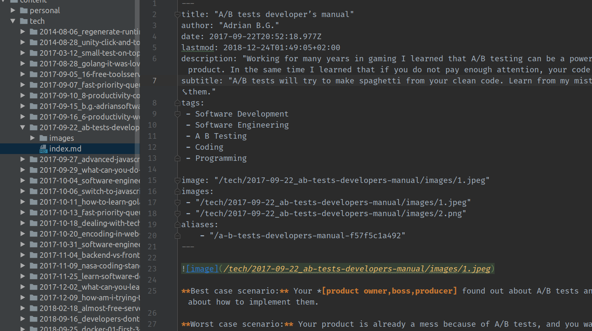

# Medium to Hugo 
Tool for the migration of articles from a medium.com account to a static website generator with markdown like Hugo.

Here is a preview from my own migration (from medium to Hugo):

## Features:
* transform HTML posts to markdown
* ignores comments and empty articles
* SEO friendly (keeps the old URL as an **alias**)
* keeps all the metadata and adds most Hugo front Matter, including the alias with the old URL
* even if one article fails it keeps going
* marks the **drafts** as "draft_"
* Fetch the article **TAGS** (which are not included in the Medium exporter), compatible with Hugo Related feature
* Fetch all the **Images** and puts them in each articles bundle
* stories are ordered by date (`year-month-day_slug`)
* custom `.Params`: image, images, slug, subtitle
* minimal HTML cleanup (removed empty URLs, duplicate title and so on)

## Usage 

1. Download your [medium data](https://help.medium.com/hc/en-us/articles/115004745787-Download-your-information)
2. Unzip it
3. Download our binary (see Releases)
4. Run something like `./mediumtohugo /path/to/export/posts /path/to/hugo/content/ posts`

### Build / Contribute
You need Bash, Go 1.11+

See Issues for a list of TODOs.